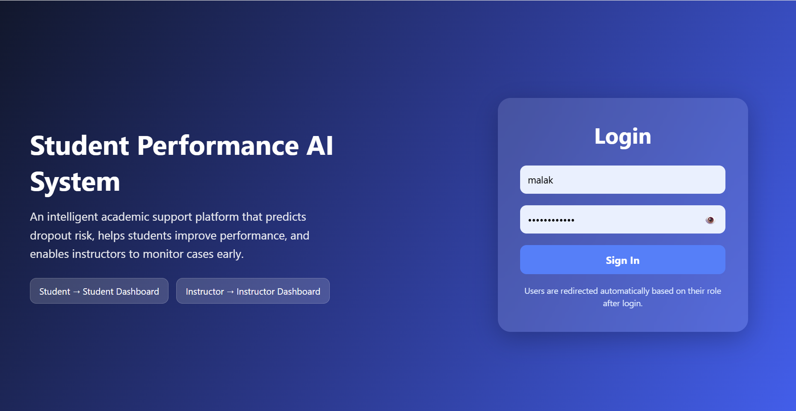
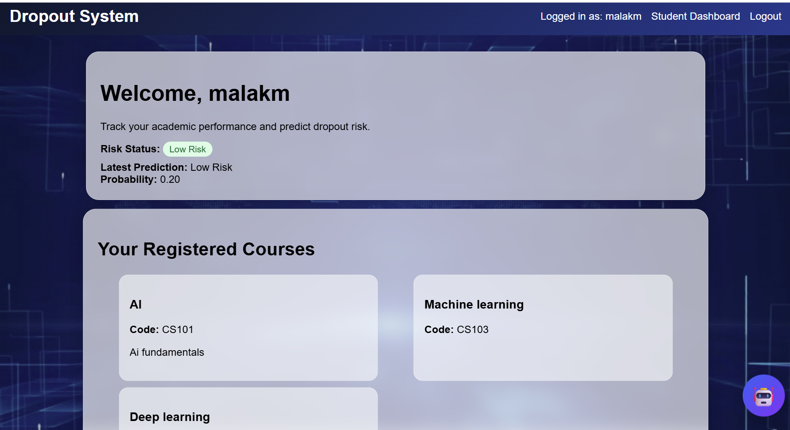
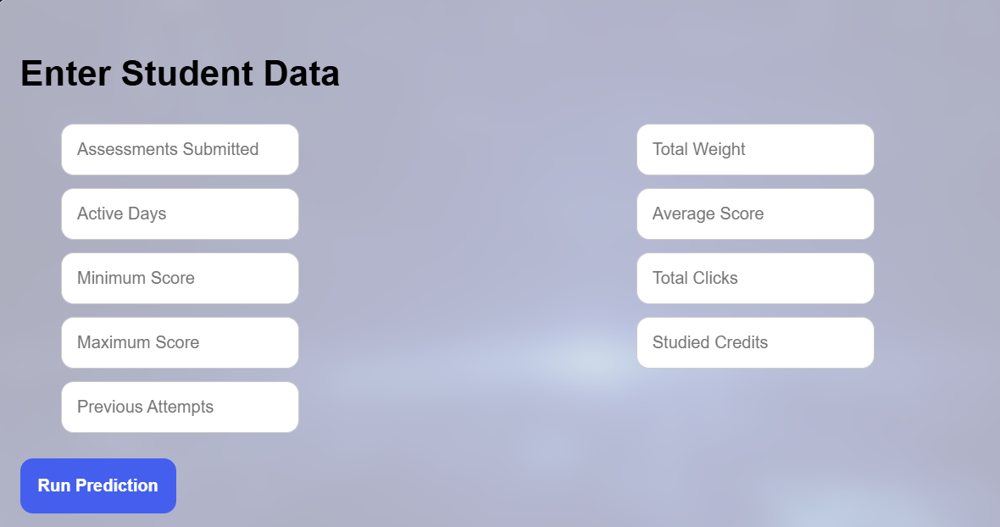
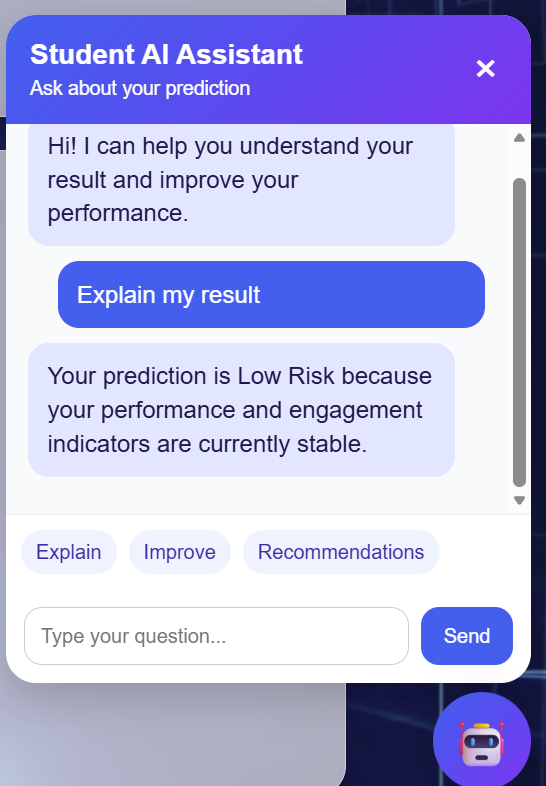
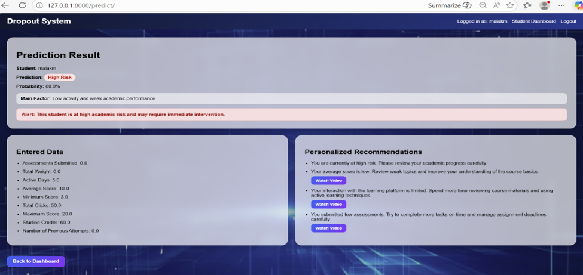
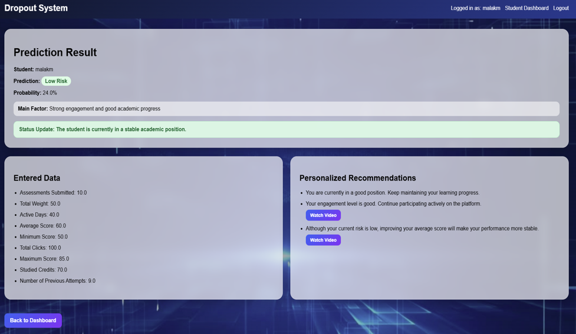
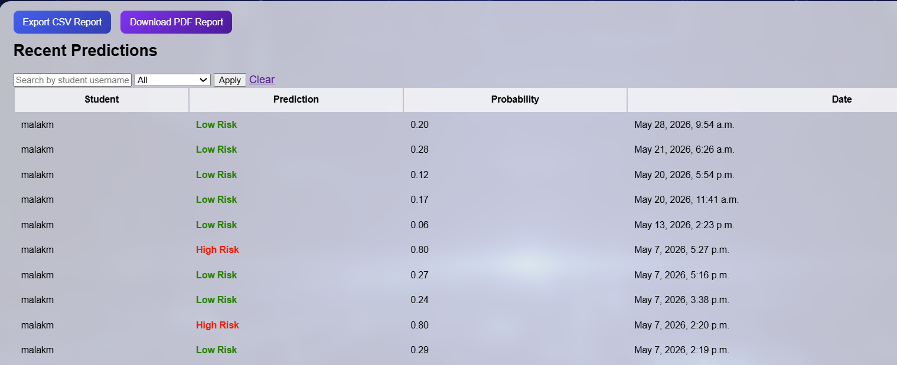
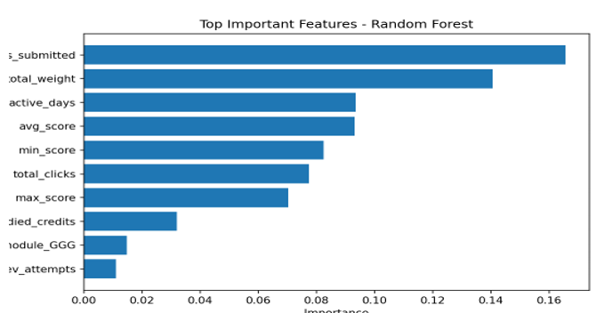

# 🎓 Student Performance Classification and Prediction
An AI-powered web application designed to predict student academic performance and dropout risk using Machine Learning and Django.

## 📌 Project Overview
This project aims to help educational institutions identify at-risk students early and provide personalized recommendations to improve academic outcomes.
The system combines Machine Learning models with a Django web application to deliver predictions through an interactive interface for students and instructors.

## ✨ Features
- Student performance prediction
- Dropout risk detection
- Student dashboard
- Instructor dashboard
- Personalized recommendations
- Automated email notifications
- PDF report generation
- Secure user authentication

## 🤖 Machine Learning
The project includes:
- Logistic Regression
- Decision Tree
- Random Forest

Data preprocessing techniques:
- Data cleaning
- Feature engineering
- One-Hot Encoding
- StandardScaler

## 🛠 Technologies

### Backend
- Python
- Django
- SQL

### Machine Learning
- Pandas
- NumPy
- Scikit-learn

### Frontend
- HTML
- CSS
- JavaScript

## 📊 Dataset
OULAD (Open University Learning Analytics Dataset)

## 🎯 Project Goal
To provide an intelligent early warning system that helps educational institutions improve student success and reduce dropout rates.

## 👩‍💻 Developer
Malak Mostafa Abdelfattah Ahmed
AI Engineer | Python Developer

## 📸 Screenshots
### Login Page

### Student Dashboard

### Student Prediction Form

### AI Assistant

### High Risk Prediction

### Low Risk Prediction

### Instructor Dashboard

### Prediction History

### Feature Importance

